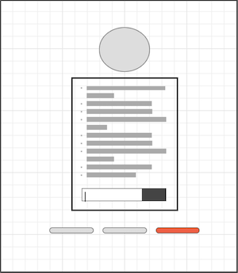

# Development Strategy

> `project-local-storage-event-delegation`

A beginner project where we work collaboratively on Document Object Model. That is a small site with sort of tapas menu, where site-visitor can add things which save in menu after refresh the page. And also if site-visitor want he can check and uncheck menu items.  
For the aim to alive the page it's added css-effects: shadow move mouse and spacing/blur/base color.

## Wireframe

## 0. Set-Up

### Repository

- Created a new repository
- Cloned the repository
- Added HTML and CSS features for user interface
- Added JS template files
- Started `development-strategy.md` file
- Created issues
- Pushed the changes
- Turned on GitHub Pages

## 1. Button Add-item

**As a site visitor...**

> assigned to `oguz`  
> reviewers `olga` , `yauh` and `sayed`

## Repo

This user story was developed on a branch called `add-item`

## JS

- Got element with `querySelector` method
- Created an array to store user input
- Created a function to get user input and store in our array with `push()` method
- Used `LocalStorage`, `.setItem()` and `.getItem()` property to prevent the list disappear when the page is refreshed
- Created another function for converting our array to a string with `map()` method and change the HTML content with `.innerHTML` property

## HTML

- I moved the `script` tags into the `body` tag

---

## 2. Function to save items

**As a site visitor I want to see my list saved**

> assigned to `Yauheniya`  
> reviewers `Oguz` , `Olga` and `Pavel`

## Repo

This user story was developed on a branch called `save`

## JS

- Oguz created function for converting our array to a string with `map()` method and change the HTML content with `.innerHTML` property, with `join` method to finalise.

## HTML

- Added input tag for visual checkbox option with JS ternary condition.

---

## 3. Function to check/ uncheck items

**As a site visitor I want to be able to check or uncheck items from menu...**

> assigned to `Sayed`  
> reviewers `Oguz` and `Olga`

## Repo

This user story was developed on a branch called `Done-item`

## JS

- created the function called `checkedDone()`
- Added an `input` element in `add-item.js`
- Added event listener

## HTML

- Nothing

## CSS

---

## 4. Update CSS variables: spacing-blur-base-color

**As a site visitor...**

> assigned to `____`  
> reviewers `____` , `____` and `____`

## Repo

This user story was developed on a branch called `______`

## JS

## HTML

## CSS

---

## 5. Shadow move mouse effect on menu

**As a site visitor...**

> assigned to `____`  
> reviewers `____` , `____` and `____`

## Repo

This user story was developed on a branch called `______`

## JS

## HTML

## CSS

---
